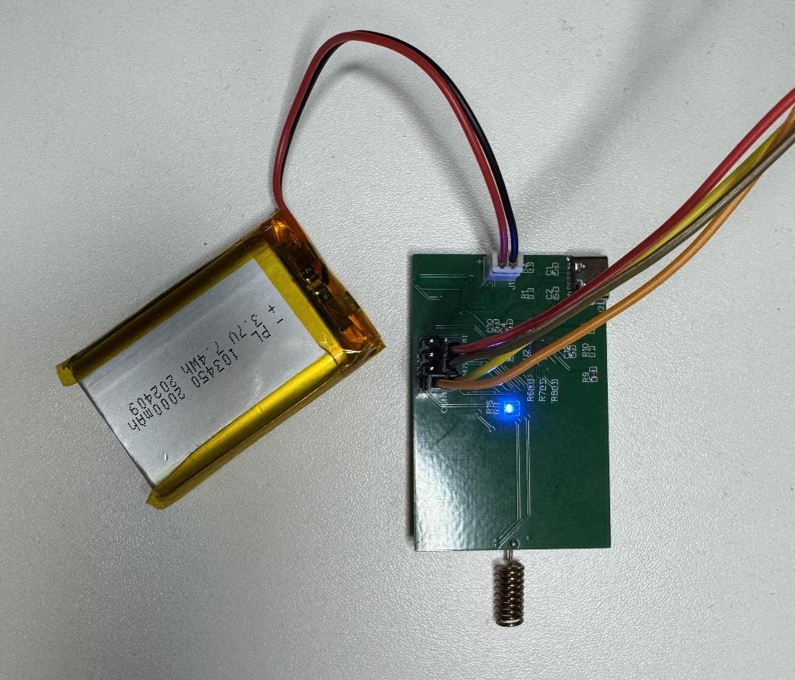
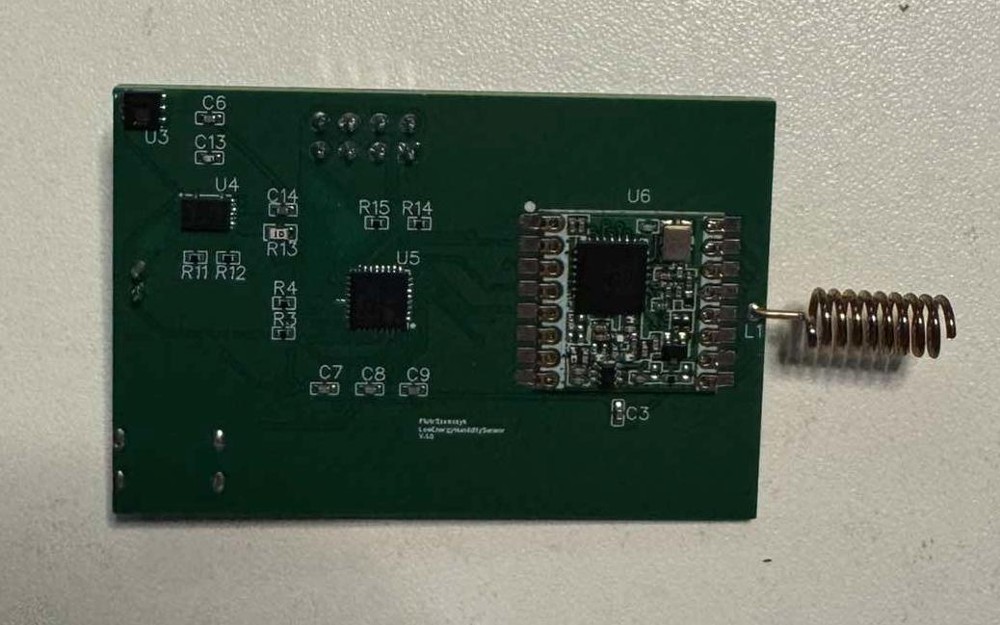
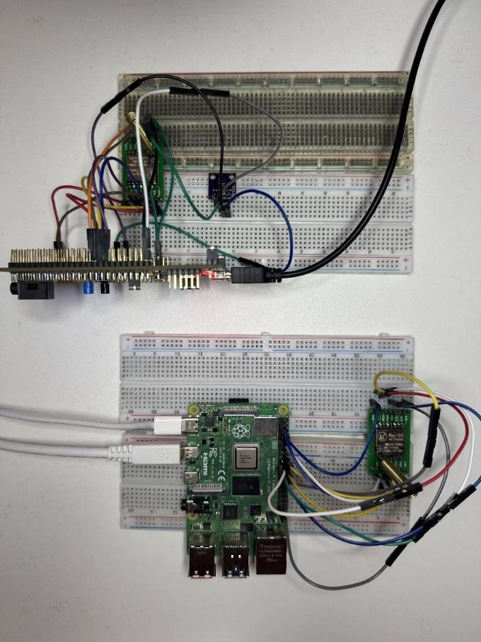
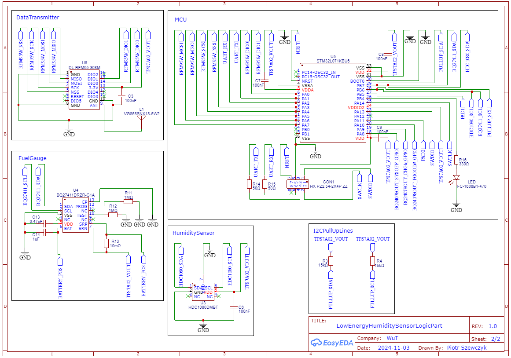
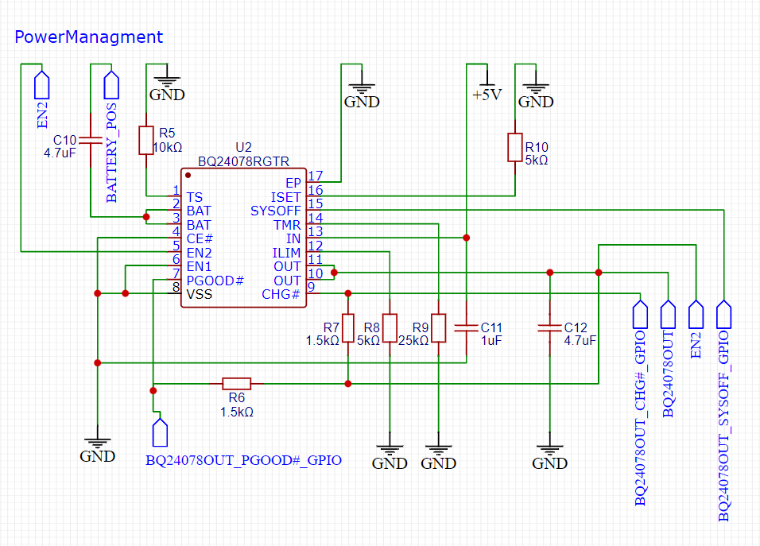
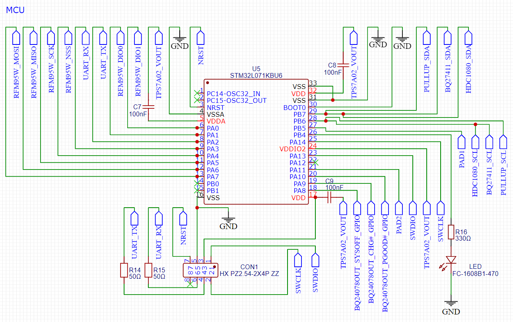
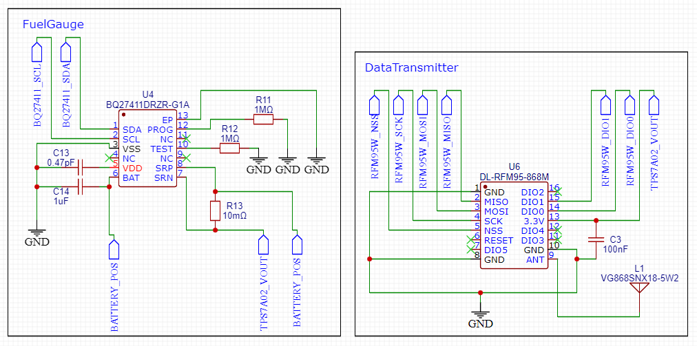
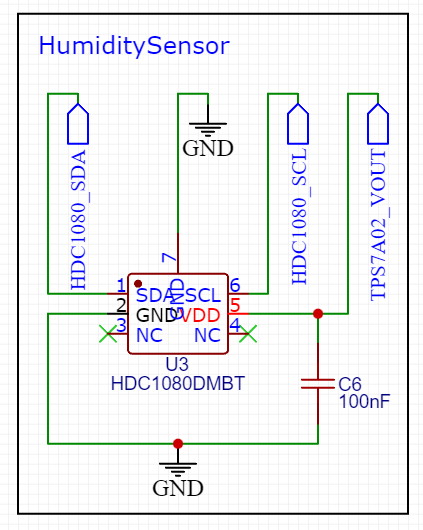
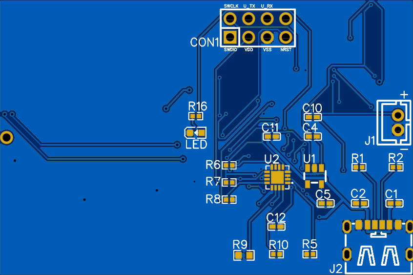
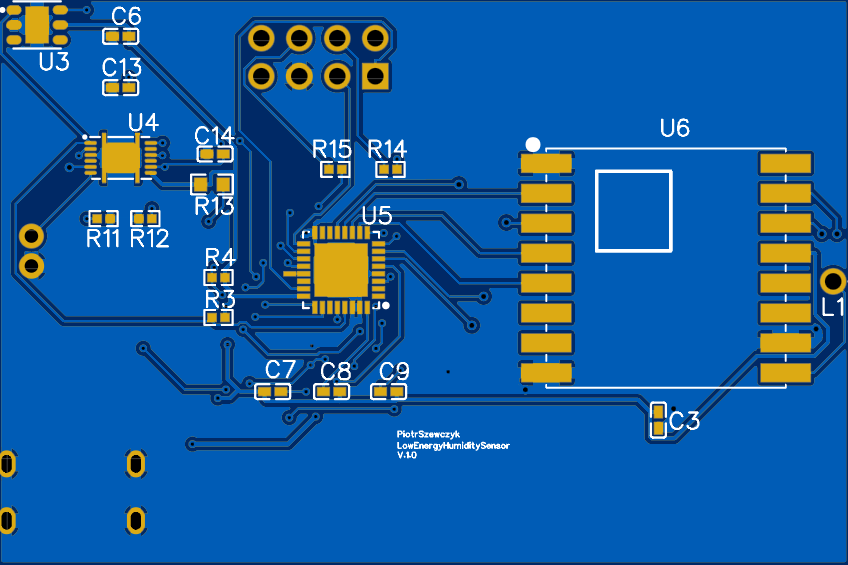

# LoRa Wireless Humidity Sensor

[](https://opensource.org/licenses/MIT)
[](https://www.st.com/en/microcontrollers-microprocessors/stm32l0-series.html)
[](https://lora-alliance.org/)

> **Bachelor Thesis Project** - A complete IoT solution for wireless environmental monitoring using LoRa communication, featuring a custom-designed PCB with ultra-low power consumption.

**Author:** Piotr Szewczyk  
**University:** Warsaw University of Technology  
**Year:** 2025

---

## Table of Contents

- [Overview](#overview)
- [Features](#features)
- [System Architecture](#system-architecture)
- [Hardware](#hardware)
- [Software](#software)
- [Project Structure](#project-structure)
- [Getting Started](#getting-started)
- [Configuration](#configuration)
- [Power Consumption](#power-consumption)
- [Documentation](#documentation)
- [License](#license)

---

## Overview

This project implements a **wireless humidity and temperature monitoring system** using **LoRa (Long Range)** technology. The system consists of:

1. **Sensor Node** - A battery-powered, custom PCB device that measures environmental conditions and transmits data wirelessly
2. **Gateway/Receiver** - A Raspberry Pi-based receiver that collects data and publishes it to an MQTT broker for integration with home automation systems

The sensor is designed for **ultra-low power consumption**, making it ideal for remote monitoring applications in agriculture, warehouses, smart homes, and industrial environments.



---

## Features

| Feature | Description |
|---------|-------------|
| **Temperature Monitoring** | High-precision measurement with HDC1080 sensor (±0.2°C accuracy) |
| **Humidity Monitoring** | Accurate humidity readings (±2% RH accuracy) |
| **Long-Range Communication** | LoRa 868 MHz with RFM95 module (up to several km range) |
| **Battery Monitoring** | Integrated BQ27411 fuel gauge for accurate battery level reporting |
| **Ultra-Low Power** | STM32L0 low-power modes for extended battery life |
| **Smart Alerts** | Automatic alerts for low battery (<20%) or high humidity (>70%) |
| **MQTT Integration** | Seamless integration with home automation systems (Home Assistant, etc.) |
| **Custom PCB Design** | Professionally designed 2-layer PCB with all manufacturing files included |

---

## System Architecture

```
┌─────────────────────────────────────────────────────────────────────────────┐
│                           SENSOR NODE (Battery Powered)                     │
│  ┌──────────────┐   ┌──────────────┐   ┌──────────────┐   ┌──────────────┐  │
│  │   HDC1080    │   │   BQ27411    │   │  STM32L071   │   │    RFM95     │  │
│  │  Temp/Hum    │──▶│  Fuel Gauge  │──▶│     MCU      │──▶│   LoRa TX    │  │
│  │   Sensor     │   │   (I2C)      │   │  (I2C/SPI)   │   │   868 MHz    │  │
│  └──────────────┘   └──────────────┘   └──────────────┘   └──────┬───────┘  │
└──────────────────────────────────────────────────────────────────┼──────────┘
                                                                   │ LoRa
                                                                   ▼
┌─────────────────────────────────────────────────────────────────────────────┐
│                          GATEWAY (Raspberry Pi)                             │
│  ┌──────────────┐   ┌──────────────┐   ┌──────────────┐   ┌──────────────┐  │
│  │    RFM95     │   │   Python     │   │    MQTT      │   │    Home      │  │
│  │   LoRa RX    │──▶│   Receiver   │──▶│   Broker     │──▶│  Automation  │  │
│  │   868 MHz    │   │   Script     │   │ (Mosquitto)  │   │              │  │
│  └──────────────┘   └──────────────┘   └──────────────┘   └──────────────┘  │
└─────────────────────────────────────────────────────────────────────────────┘
```

---

## Hardware

### Assembled PCB

| Sensor Node PCB | With Battery Connected |
|:---------------:|:----------------------:|
|  |  |

### Gateway (Raspberry Pi)



### Schematic

The complete schematic includes four main sections:



| Power Management | MCU Section |
|:----------------:|:-----------:|
|  |  |

| Fuel Gauge & LoRa | Humidity Sensor |
|:-----------------:|:---------------:|
|  |  |

### PCB Layout

| Power Section | Main Section |
|:-------------:|:------------:|
|  |  |

### Main Components

| Component | Part Number | Function | Interface |
|-----------|-------------|----------|-----------|
| **Microcontroller** | STM32L071KBU6 | Ultra-low-power ARM Cortex-M0+ | - |
| **Humidity/Temperature Sensor** | HDC1080DMBT | Environmental sensing | I2C |
| **LoRa Module** | DL-RFM95-868M | Wireless communication | SPI |
| **Battery Fuel Gauge** | BQ27411DRZR-G1A | Battery level monitoring | I2C |
| **LDO Voltage Regulator** | TPS7A0233PDBVR | 3.3V power supply | - |
| **Battery Charger** | BQ24078RGTR | Li-Ion/Li-Po charging via USB-C | - |
| **Antenna** | VG868SNX18-5W2 | 868 MHz helical antenna | - |

### PCB Details

- **Layers:** 2-layer PCB
- **Dimensions:** Compact design for portable applications
- **Connectors:** 
  - USB Type-C for charging
  - JST PH 2.54mm for battery connection
  - 2x4 pin header for programming/debugging

### Manufacturing Files

The `załączniki/` directory contains all files needed for PCB manufacturing:

- `Gerber_HumSensorV1.0_PCB_HumSensorV1.0_2025-01-28/` - Gerber files for PCB fabrication
- `BOM_HumSensorV1.0_2025-01-28.csv` - Bill of Materials with LCSC part numbers
- `PickAndPlace_PCB_HumSensorV1.0_2025-01-28.csv` - Pick and place file for SMT assembly

---

## Software

### Sensor Node Firmware (STM32)

The firmware is developed using **STM32CubeIDE** and the **STM32 HAL library**.

**Key Features:**
- Ultra-low power operation using STM32 STOP mode
- RTC-based wake-up for periodic measurements
- Averaged humidity readings for stable data
- LoRa transmission with error handling
- Automatic alert generation for critical conditions

**Driver Modules:**

| File | Description |
|------|-------------|
| `hdc1080.c/.h` | HDC1080 temperature/humidity sensor driver |
| `rfm95.c/.h` | RFM95 LoRa transceiver driver |
| `bq27411.c/.h` | BQ27411 battery fuel gauge driver |
| `main.c` | Main application logic |

### Gateway/Receiver (Python)

The receiver runs on a **Raspberry Pi** and communicates with the sensor via LoRa.

**Features:**
- Continuous LoRa message reception
- Data parsing and validation
- MQTT publishing for home automation integration

**MQTT Topics:**
```
home/lora/temperature  →  Temperature in °C
home/lora/humidity     →  Humidity in %
home/lora/battery      →  Battery level in %
```

---

## Project Structure

```
311105_inz/
├── README.md                          # This file
├── images/                            # Project photos and schematics
│   ├── pcb_assembled.jpg              # Assembled PCB
│   ├── complete_system.jpg            # Complete sensor with battery
│   ├── gateway_raspberry_pi.jpg       # Raspberry Pi gateway
│   ├── schematic_full.png             # Full schematic
│   ├── schematic_mcu.png              # MCU section schematic
│   ├── schematic_power.png            # Power management schematic
│   ├── pcb_layout_main.png            # PCB layout (main)
│   └── pcb_layout_power.png           # PCB layout (power)
├── załączniki/                        # Project attachments
│   ├── 311105_inz.pdf                 # Full thesis documentation (Polish)
│   │
│   ├── HumiditySensor/                # Main firmware project
│   │   └── HumiditySensor/
│   │       ├── Core/
│   │       │   ├── Inc/               # Header files
│   │       │   │   ├── hdc1080.h      # Temperature/humidity sensor
│   │       │   │   ├── rfm95.h        # LoRa transceiver
│   │       │   │   ├── bq27411.h      # Battery fuel gauge
│   │       │   │   └── main.h
│   │       │   └── Src/               # Source files
│   │       │       ├── hdc1080.c
│   │       │       ├── rfm95.c
│   │       │       ├── bq27411.c
│   │       │       └── main.c
│   │       ├── Drivers/               # STM32 HAL drivers
│   │       └── HumiditySensor.ioc     # STM32CubeMX configuration
│   │
│   ├── Gerber_HumSensorV1.0.../       # PCB Gerber files
│   ├── BOM_HumSensorV1.0_2025-01-28.csv        # Bill of Materials
│   ├── PickAndPlace_PCB_HumSensorV1.0_2025-01-28.csv  # SMT assembly file
│   │
│   ├── RFM95_receiver.py              # Full-featured LoRa receiver
│   ├── lora_receiver.py               # Simple LoRa receiver
│   │
│   ├── hdc1080testing.c               # HDC1080 test driver
│   ├── loratesting.c                  # LoRa test driver
│   │
│   ├── testingdht11/                  # DHT11 sensor testing (Arduino)
│   │   └── testingdht11.ino
│   └── testingsyh2r/                  # SYH-2R sensor testing (Arduino)
│       └── testingsyh2r.ino
```

---

## Getting Started

### Prerequisites

**For Sensor Node:**
- STM32CubeIDE (or any ARM GCC toolchain)
- ST-Link programmer/debugger
- USB Type-C cable for charging

**For Raspberry Pi Gateway:**
- Raspberry Pi (any model with SPI support)
- RFM95 LoRa module connected via SPI
- Python 3.x with required packages

### Building the Firmware

1. Clone this repository:
   ```bash
   git clone https://github.com/peszew/lora-humidity-sensor.git
   ```

2. Open the project in STM32CubeIDE:
   ```
   File → Open Projects from File System → Select załączniki/HumiditySensor/HumiditySensor
   ```

3. Build and flash to the STM32L071:
   ```
   Project → Build All
   Run → Debug
   ```

### Setting Up the Receiver

1. Install Python dependencies:
   ```bash
   pip install spidev paho-mqtt
   ```

2. Enable SPI on Raspberry Pi:
   ```bash
   sudo raspi-config
   # Navigate to: Interfacing Options → SPI → Enable
   ```

3. Run the receiver script:
   ```bash
   python3 RFM95_receiver.py
   ```

---

## Configuration

### LoRa Parameters

| Parameter | Value | Description |
|-----------|-------|-------------|
| Frequency | 868 MHz | EU ISM band (adjust for your region) |
| Bandwidth | 125 kHz | Standard LoRa bandwidth |
| Spreading Factor | SF7 | Balance between range and speed |
| Coding Rate | 4/5 | Error correction level |

To modify these, edit `rfm95.h`:

```c
#define DEFAULT_FREQUENCY 868000000  // Frequency in Hz
#define DEFAULT_BANDWIDTH 0x72       // 125 kHz
#define DEFAULT_SPREADING_FACTOR 0x74 // SF7
```

### Alert Thresholds

Configured in `main.c`:

```c
if (batteryLevel < 20.0 || humidity > 70.0) {
    // Send alert message
}
```

---

## Power Consumption

The system is optimized for battery operation:

| Mode | Current | Description |
|------|---------|-------------|
| Active (Measuring + Transmitting) | ~50 mA | Brief periods during data transmission |
| STOP Mode (Sleep) | ~2 µA | Most of the operating time |

With a **2000 mAh battery** and measurements every hour, the expected battery life is **several months**.

---

## Documentation

The complete thesis documentation is available in:

**`załączniki/311105_inz.pdf`** (Polish language)

This includes:
- Detailed theoretical background
- System design decisions
- Hardware schematics
- Software implementation details
- Test results and measurements
- Conclusions and future work

---

## License

This project is licensed under the MIT License - see the [LICENSE](LICENSE) file for details.

---

## Acknowledgments

- STMicroelectronics for the STM32 HAL library
- Texas Instruments for HDC1080 and BQ27411 sensor datasheets
- Semtech for LoRa technology documentation
- Warsaw University of Technology

---

<p align="center">
  <i>Bachelor Thesis Project</i><br>
  <b>Piotr Szewczyk</b><br>
  Warsaw University of Technology, 2025
</p>
